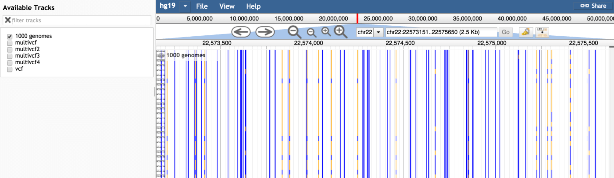

# multivariantviewer

A JBrowse plugin that adds some custom glyphs for variants on a "multi VCF" file (VCF with multiple individuals)

## Example configuration

    {
        "type": "MultiVariantViewer/View/Track/MultiVariantViewer",
        "urlTemplate": "variants.vcf.gz",
        "label": "Variant track",
        "storeClass": "JBrowse/Store/SeqFeature/VCFTabix",
        "style": {
            "height":1,
            "color": "function(feat,gt,fullgt) { return gt=='ref'? 'blue': 'orange'; }"
        }
    }

## Options

* style->height - height of each individual. Default: 5px
* style->color - a color or a callback that colors every individual on the chart, which receives three arguments: the feature, a string that says 'ref' or 'alt', the actual genotype as 0|0 or 0|1 or similar. defaults to coloring 'ref' as green and 'alt' as red

## Screenshot

## Installation

Clone the repo to your plugins directory and name it VariantTrack

    git clone https://github.com/cmdcolin/variant_track.git VariantTrack

