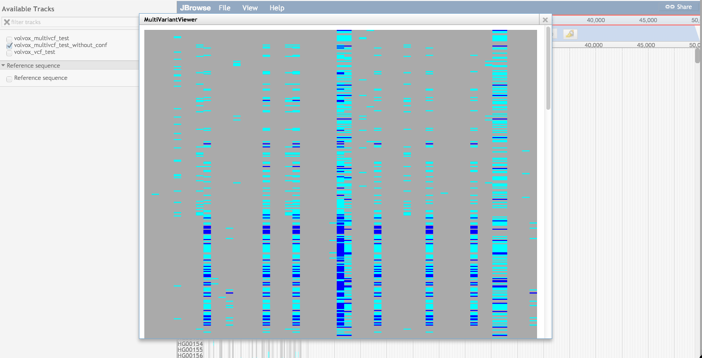
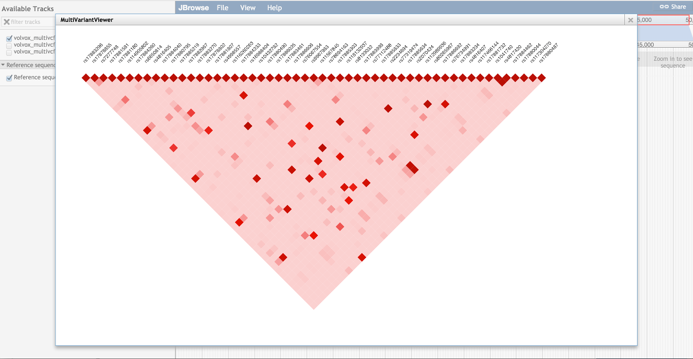

# multivariantviewer

A JBrowse plugin that adds some custom glyphs for variants on a "multi VCF" file (VCF with multiple samples)

## Options

### Tracktype
 
* `MultiVariantViewer/View/Track/Grid` - displays all genotypes for features
* `MultiVariantViewer/View/Track/LDTrack` - displays ld triangle on the genome browser
* `MultiVariantViewer/View/Track/Matrix` - displays all genotypes for features in matrix form

### Style options

* `style->height` - Pixel height for each sample. Default: 12
* `style->offset` - Pixel offset between each sample. Default: 0
* `style->ref_color` - Color for reference allele. Default grey
* `style->het_color` - Color for heterozygous allele. Default cyan
* `style->hom_color` - Color for homozygous allele. Default blue
* `style->matrixColor` - If you make ref_color, het_color, and hom_color null, then this function is called to determine the color. See below for function prototype

The matrixColor callback can change those colors if ref_color/het_color/hom_color are set to null. The matrixColor function signature is `function(feature, type, genotype)` where `type` is either 'ref' or 'alt' and `genotype` is the actual genotype as 0|0 or 0|1 or similar and `feature` contains all info about a particular variant

### Grid specific options

* `showLabels` - Display subtrack labels (default: true)
* `showTooltips` - Display mouseover tooltips with subtrack name and description (default: true)
* `clickTooltips` - Display tooltips on click instead of mouseover if showTooltips is true (default: false)
* `labelFont` - Specify subtrack label font CSS e.g. "6px sans-serif"
* `labelWidth` - Specify a specific width for all subtrack labels. Default autosizes to each sublabel's length, which can look ugly
* `includeIndels` - Include indels. Default false since if these are overlapping it will complicate the display. By default only renders things with type SNV

### Grid and matrix options

* `sublabels` - An array of structures like {"name": "sample1", "color": "red", "description": "Optional description or sample displayed on mouseover", "population": "CEU"}
* `sortByPopulation` - Sorts genotypes by population. Also available from track menu

The sublabels are optional, and the sample names from the VCF are shown if not specified, but coloring the labels and things can be added via sublabels

### LD viewing options

* `ldviewer` - URL for the linkage_server service. Default http://localhost:4730/
* `maf` - Set minor allele frequency cutoff. Default 0.01

## Example configuration

### Simple config for Grid track type

    [tracks.variant]
    urlTemplate=file.vcf.gz
    storeClass=JBrowse/Store/SeqFeature/VCFTabix
    type=MultiVariantViewer/View/Track/Grid
    showLabels=true
    
### Simple config for the Matrix track type

    [tracks.matrix]
    urlTemplate=file.vcf.gz
    storeClass=JBrowse/Store/SeqFeature/VCFTabix
    type=MultiVariantViewer/View/Track/Matrix

### Simple config for the LDTrack type

Assumes that the ldserver is running on port 4730 on localhost. Of course change localhost if serving to the public, and you may also want to reverse proxy the port onto port 80 to avoid any weird firewall blocking that would be the consequence of serving on a different port

    [tracks.matrix]
    urlTemplate=file.vcf.gz
    storeClass=JBrowse/Store/SeqFeature/VCFTabix
    type=MultiVariantViewer/View/Track/LDTrack
    ldserver=http://localhost:4730/
    
### More sophisticated config for Grid track type

You can also add colors and population info for the subtrackl labels
    
    [tracks.variant_with_colors]
    urlTemplate=file.vcf.gz
    storeClass=JBrowse/Store/SeqFeature/VCFTabix
    type=MultiVariantViewer/View/Track/Grid
    showLabels=true
    labelFont=4px sans-serif
    style.height=10
    sublabels+=json:{"name": "sample1", "color": "blue", "description": "mouseover description", "population": "CEU"}
    sublabels+=json:{"name": "sample2", "color": "red", "description": "mouseover description", "population": "CEU"}

Note that sublabel config is not necessarily, it is only used to add colors and population info

Also note that adding style.height=10 sets how tall each subtrack is. 

### Example config in JSON format

The above configs are tracks.conf based, but you can do the same thing in trackList.json too

In trackList.json format

    {
        "type": "MultiVariantViewer/View/Track/Grid",
        "urlTemplate": "variants.vcf.gz",
        "label": "Variant track",
        "storeClass": "JBrowse/Store/SeqFeature/VCFTabix",
        "showLabels": true
    }

## Sample browser

See test subdirectory for example, you can use http://localhost/jbrowse/?data=plugins/MultiVariantViewer/test/data to see the sample data

## Screenshots

Shows 1000genomes VCF data, tooltips on sidebar

Displays matrix of variants

Shows LD

## Install plugin

Clone the repo to your plugins directory and name it MultiVariantViewer

    git clone https://github.com/cmdcolin/multivariantviewer MultiVariantViewer

Then add it to your jbrowse config

    "plugins": ["MultiVariantViewer"]
    
See http://gmod.org/wiki/JBrowse_FAQ#How_do_I_install_a_plugin for more details

## linkage_server

Optionally, LD can be calculated from the VCF files on the server side using plink and rendered as a classic block view.

### Pre-requisites linkage_server

* tabix
* plink2 aka plink 1.9

### Install linkage_server

    npm install

### Run linkage_server

    node linkage_server/index.js

You might also find it useful to use a node.js taskrunner like forever or pm2

